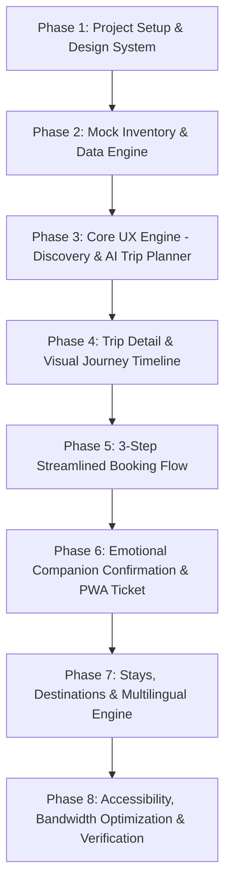

# KSTDC — "Karnataka, Your Way" (Build What Moves India)
## Pin-to-Pin Master Implementation Plan & Architectural Blueprint

---

## Executive Summary & Vision Alignment

### Core Problem & Hackathon Focus
The official **Build What Moves India** brief mandates solving one clearly defined citizen journey end-to-end: transforming how an Indian traveller discovers, personalizes, understands, and books state tourism experiences.

Current KSTDC digital channels force travellers to navigate internal organizational departments, cryptic package codes (`TPTF`, `Somanathapura-Shivanasamudra-Talakadu-Mudukuthore`), and complex legal tariff tables.

**The Solution — "Karnataka, Your Way"**:
A citizen-first, mobile-optimized, multilingual digital experience that shifts from **"organization-centric directory"** to **"intent-driven travel discovery & booking engine"**.

```
[ Traditional KSTDC ]
User ──> Internal Categories ──> Cryptic Package Codes ──> 10-Tab Legal Tariffs ──> Fragmented ASPX Booking

[ "Karnataka, Your Way" Redesign ]
User Intent ──> AI / Rule Filter ──> Visual Journey & Timeline ──> Transparent Pricing ──> 3-Step Express Booking ──> Companion Confirmation Ticket
(Bengaluru · 2 Days · Nature) ───────> (Coorg Escape) ───────> (Transport + Mayura Stay) ───────> (Mobile-Ready PWA)
```

---

## Design System & Token Foundation (Adapted from `DESIGN-meta.md`)

The visual design language fuses **luxury travel editorial + modern booking engine + public-service trust**, adhering to the geometric and typographic principles of `DESIGN-meta.md` while utilizing authentic Karnataka tones:

### 1. Color Palette Tokens
| Token | Hex Value | Semantic Usage |
|---|---|---|
| `colors.brand-forest` | `#14452F` | Primary brand color, headers, primary marketing CTAs |
| `colors.brand-forest-deep`| `#0D2E1F` | Hover/pressed state, dark mode accents |
| `colors.brand-sand` | `#D4A373` | Sandalwood & temple stone gold accent, active highlights |
| `colors.brand-terracotta` | `#C65D3B` | Warm earth accent, urgent alerts, special tags |
| `colors.commerce-action` | `#0A66C2` / `#1B74E4` | Direct booking action ("Book Now", "Proceed to Payment") |
| `colors.canvas-ivory` | `#FAF7F2` | Warm off-white canvas for reduced eye fatigue |
| `colors.surface-card` | `#FFFFFF` | Card surface with crisp `1px` subtle hairline border |
| `colors.surface-soft` | `#F4F0EA` | Neutral background for pill filters, spec bars, thumbnails |
| `colors.ink-primary` | `#111814` | Primary high-contrast text (AAA accessible) |
| `colors.ink-muted` | `#4B5550` | Secondary description & metadata text |
| `colors.hairline` | `#E5DFD5` | Subtle dividers and card borders |
| `colors.success-green` | `#15803D` | Inclusions, confirmed statuses, verified badges |

### 2. Typography Hierarchy
- **Display & Headings**: *Playfair Display* / *Cormorant Garamond* / *Plus Jakarta Sans* (Weight 600–700)
- **UI, Controls & Body**: *Inter* / *Plus Jakarta Sans* (Letter-spacing `-0.14px` to `-0.16px`, standard line heights `1.45–1.50`)

### 3. Geometry & Corner Radii
- **Buttons & Chips**: `{rounded.full}` (100px pill buttons)
- **Photographic Feature Cards**: `{rounded.xxxl}` (24px–32px)
- **Interactive Option / Spec Tiles**: `{rounded.xl}` (16px)
- **Form Inputs & Selectors**: `{rounded.lg}` (10px–12px, 44px min height for touch targets)

---

## Master Phase-by-Phase Implementation Blueprint



---

### Phase 1: Project Scaffolding & Design Foundation
**Objective**: Build the Next.js / TypeScript structure, install dependencies, configure Tailwind with design tokens, and establish the responsive layout shell.

#### Key Deliverables:
1. **Next.js 14 App Router Setup**:
   - `src/app/layout.tsx` (Global providers, font injection, SEO metadata, PWA manifest)
   - `src/app/page.tsx` (Main landing experience)
   - `src/styles/globals.css` (CSS variables, reset, font definitions, micro-animations)
   - `tailwind.config.ts` (Design tokens mapped from `DESIGN-meta.md`)
2. **Global Shell Components**:
   - `TopNav`: Pill-tab navigation (`Explore`, `Trips`, `Stays`, `Destinations`, `My Bookings`), language dropdown (`EN`, `ಕನ್ನಡ`, `हिन्दी`), accessibility toggle (A+/A-, High Contrast), and high-visibility `"Plan My Trip"` action button.
   - `MobileDrawer`: Bottom-sheet / slide-over mobile navigation with large 48px touch targets.
   - `DisclaimerBanner`: Transparent hackathon prototype disclosure bar.
   - `Footer`: Clean editorial 4-column footer with public service trust indicators, emergency helpline (24x7 Karnataka Tourism 1800-425-3333), RTI link mock, and sustainability pledges.

---

### Phase 2: Mock Inventory & Travel Data Architecture
**Objective**: Build a robust, strongly-typed JSON database covering Karnataka destinations, KSTDC curated tour packages, Mayura hotels, and booking structures.

#### Data Models (`src/types/travel.ts`):
```typescript
export interface TripPackage {
  id: string;
  slug: string;
  title: string;
  tagline: string;
  category: 'nature' | 'heritage' | 'spiritual' | 'beach' | 'adventure' | 'weekend';
  origin: string; // e.g., 'Bengaluru', 'Mysuru', 'Hubballi'
  destination: string; // e.g., 'Coorg (Madikeri)', 'Hampi', 'Gokarna'
  durationDays: number;
  durationNights: number;
  pricePerPerson: number;
  originalPrice?: number;
  badge?: string; // 'Best Seller', 'Weekend Special', 'Monsoon Favorite'
  rating: number;
  reviewsCount: number;
  heroImage: string;
  galleryImages: string[];
  vehicleType: string; // 'Volvo AC Coach (45-seater)', 'AC Tempo Traveller'
  hotel: {
    name: string;
    property: string; // 'Hotel Mayura Valley View'
    roomType: string; // 'Deluxe AC Room'
    rating: number;
    image: string;
  };
  inclusions: string[];
  exclusions: string[];
  departureSchedule: {
    time: string;
    pickupPoint: string;
    frequency: string; // 'Every Friday & Saturday', 'Daily'
  };
  itinerary: Array<{
    day: number;
    title: string;
    events: Array<{
      time: string;
      title: string;
      description: string;
      icon: string;
      locationName: string;
      mealIncluded?: boolean;
    }>;
  }>;
  knowBeforeYouGo: {
    cancellation: string;
    idProof: string;
    dressCode?: string;
    seniorFriendly: boolean;
    packingTips: string[];
  };
  explainWhy: {
    travelTimeHours: number;
    sightseeingTimeHours: number;
    leisureTimeHours: number;
    suitability: string;
  };
}
```

#### Core Pre-loaded Circuits:
1. **Coorg Mist & Waterfalls** (2 Days / 1 Night from Bengaluru — Flagship Demo)
2. **Hampi: The Golden Empire** (3 Days / 2 Nights from Bengaluru)
3. **Mysuru Royal Heritage & Palace Illumination** (1 Day Express from Bengaluru)
4. **Gokarna & Murudeshwar Coastal Serenity** (3 Days / 2 Nights)
5. **Nandi Hills Sunrise & Vineyards** (1 Day Morning Escape)

---

### Phase 3: Homepage Discovery & AI Intent Trip Planner
**Objective**: Replace the cluttered organization-first directory with an interactive, intent-driven homepage hero and an instant AI Trip Planner.

#### 1. Hero Intent Selector ("Find My Trip" Engine)
- **From**: Bengaluru ▾ / Mysuru ▾ / Mangaluru ▾
- **Duration Chips**: 1 Day · 2 Days (Weekend) · 3–4 Days · 5+ Days
- **Experience Tags**: 🌿 Nature · 🏛️ Heritage · 🕉️ Spiritual · 🏖️ Beach · 👨‍👩‍👧 Family Friendly · ⛰️ Adventure
- **Budget Slider / Chips**: Under ₹2,500 · ₹2,500–₹6,000 · ₹6,000+

#### 2. Hero Interactive "Plan My Trip with AI" Modal / Panel
- **Natural Language Intent Input**:
  *Prompt presets*:
  - *"I have ₹6,000, 2 days, leaving Bengaluru with my elderly parents. Need a peaceful scenic stay."*
  - *"Solo traveller looking for an architectural heritage weekend under ₹3,500."*
  - *"Family with 2 kids wanting waterfalls and wildlife near Mysuru."*
- **Reasoning & Reduction Engine**:
  - Deterministic parser extracts `budgetMax`, `duration`, `origin`, `interests`, `travelerProfile`.
  - Filters real inventory and generates structured response with *"Why this trip is recommended for you"* explanation.
  - Interactive "Compare trips" toggle (e.g., *Why Coorg instead of Mysuru?*).

#### 3. Homepage Editorial Content Modules
- **Trending Weekend Escapes**: High-contrast photographic cards with badge tags, duration, clear price, and Mayura stay indicator.
- **"Why Choose KSTDC?"**: 4-card trust reassurance (State-certified guides, sanitized Volvo transport, government-guaranteed Mayura stays, 100% transparent pricing without hidden charges).
- **Destination Spotlight**: Interactive Karnataka regional map pins.

---

### Phase 4: Tour Detail Page (PDP) & Visual Journey Timeline
**Objective**: Build a clean, high-conversion tour page that answers *"What do I get? When? Where? How much?"* without legal text clutter.

#### Key PDP Modules:
1. **Hero & Gallery Section**:
   - 16:9 full-bleed photographic hero with badge, breadcrumbs, rating, vehicle type, and duration.
2. **Sticky Booking Summary Rail** (Desktop right rail / Mobile sticky bottom bar):
   - Clear price: `₹4,990 per person` (all taxes included, zero hidden fee promise).
   - Date picker with real-time seat availability preview (`🟢 12 seats left for this weekend`).
   - Primary cobalt/forest action button: `"Book This Trip"`.
3. **"Why This Trip?" AI Decision Helper**:
   - Visual breakdown bar: `5.5 hrs travel` · `8 hrs sightseeing` · `1 night Mayura stay` · `Relaxed pace`.
4. **Interactive Visual Journey Timeline**:
   - Step-by-step vertical route timeline with icons, departure times, sightseeing stops, and meal breaks.
5. **Clear Inclusions vs Exclusions Grid**:
   - Direct side-by-side green checkmarks (`✓ AC Volvo transport`, `✓ Mayura Deluxe stay`, `✓ Certified tour guide`) vs gray crosses (`× Meals`, `× Monument camera fees`).
6. **"Know Before You Go" Accordion**:
   - Cancellation policy (Full refund >48 hrs), ID guidelines, Senior citizen assistance, Weather advisories.

---

### Phase 5: 3-Step Streamlined Express Booking Flow
**Objective**: Modernize the legacy booking process into a zero-friction, 3-step checkout with real-time summary calculation.

```
[ Step 1: Schedule & Pick-up ] ──> [ Step 2: Passenger & Room Config ] ──> [ Step 3: Transparent Review & Pay ]
- Departure Date Calendar           - Adults (1-6)                        - Price breakdown with GST
- Pick-up point selection           - Children / Senior Citizens          - Pickup details & emergency contacts
- Seat preference selection         - Room sharing / Mayura upgrade       - Mock UPI / Card / NetBanking
```

#### Step Details:
- **Step 1 (Schedule & Boarding)**:
  - Calendar with live price and availability status.
  - Boarding point selector (e.g., *Yeshwanthpur BMMC TTMC (06:00 AM)*, *Majestic KSRTC Terminal 1 (06:45 AM)*, *KSTDC Head Office Corporation Circle (07:15 AM)*).
- **Step 2 (Travellers & Stay Preferences)**:
  - Counter inputs for Adults, Children (5–12 yrs), Seniors (60+ with automatic mobility assistance flag).
  - Room occupancy options (Twin sharing included, Single occupancy add-on).
  - Primary contact details with auto-fill test buttons (*"Fill demo traveller"*).
- **Step 3 (Transparent Review & Instant Checkout)**:
  - Complete price breakdown: Base Fare + GST (5%) - Senior Citizen Discount (if applicable) = Total Payable.
  - Payment simulator: Instant UPI QR Code simulation, Card, Net Banking (with instantaneous mock confirmation).

---

### Phase 6: Emotional Travel Companion Confirmation & Digital Ticket
**Objective**: Transform the confirmation screen into an interactive PWA Travel Companion rather than a static receipt.

#### Features:
1. **Dynamic Booking Confirmation Card**:
   - Unique Booking Reference ID (e.g., `KSTDC-2026-CRG-8841`).
   - Live Countdown to departure.
   - Pickup location Google Map navigation link & driver/coordinator helpline.
2. **One-Click Actions**:
   - **Download PDF Ticket / Pass** (Printable boarding pass format).
   - **Add to Google Calendar / Apple Calendar** (`.ics` generation).
   - **Send WhatsApp Itinerary & Live Updates**.
3. **Interactive Day-by-Day Guide**:
   - Audio guide snippet / Kannada phrasebook for tourists (*"Namaskara", "Oota aayitha?"*).
   - Weather forecast for Madikeri / Destination.
   - Recommended local cuisine (Coorg Pandi Curry / Akki Roti spots near Mayura).

---

### Phase 7: Stays ("Stay with Mayura"), Destinations & Multilingual Engine
**Objective**: Build supporting discovery channels that establish KSTDC's full state footprint.

#### Features:
1. **"Stay with Mayura" Hotel Directory**:
   - Property cards: *Hotel Mayura Valley View (Madikeri)*, *Hotel Mayura Bhuvaneshwari (Hampi)*, *Hotel Mayura Hoysala (Mysuru)*, *Hotel Mayura Gerusoppa (Jog Falls)*.
   - Amenities badges: Valley View Balcony, Pure Veg Restaurant, EV Charging, KSTDC Tour Desk.
2. **Destinations Explorer**:
   - Destination guide pages with direct linked KSTDC packages and Mayura properties.
3. **Multilingual Localization (i18n)**:
   - English / Kannada / Hindi dictionary for all UI text, trip descriptions, and booking steps.

---

### Phase 8: Accessibility, Bandwidth Optimization & Verification
**Objective**: Ensure full compliance with Build What Moves India performance & accessibility requirements.

#### Features:
- **Low-Bandwidth / 2G-3G Mode**: Optional toggle to suppress high-res images and prioritize instant text/vector rendering.
- **High-Contrast & Font-Scale Controller**: AAA-compliant contrast toggle and 3-step font sizing (100%, 120%, 140%).
- **Lighthouse Performance Targets**: 95+ on Performance, Accessibility, Best Practices, and SEO.

---

## Verification Plan

### 1. Functional Journey Tests
- **Discovery Flow**: Validate origin/duration/category chip filtering updates trip list dynamically with 0 latency.
- **AI Planner**: Test 4 natural-language scenarios (Budget constrained, Senior citizen friendly, 1-day express, Family vacation) to verify tailored result output.
- **Booking End-to-End**: Complete the 3-step checkout for 2 Adults + 1 Senior for the Coorg trip, verify instant price recalculation with GST, execute mock payment, and reach the companion ticket confirmation.
- **Offline / Local Persistence**: Confirm booking details persist in `localStorage` and can be retrieved under `"My Bookings"`.

### 2. Usability & Accessibility Testing
- Test keyboard navigation across all interactive elements (Tab, Space, Enter).
- Verify Kannada / Hindi translation switching across all primary pages.
- Verify High Contrast mode and Low-Bandwidth image suppression toggle.
- Verify responsive layout on mobile viewport (375px–420px), tablet (768px), and desktop (1280px+).
